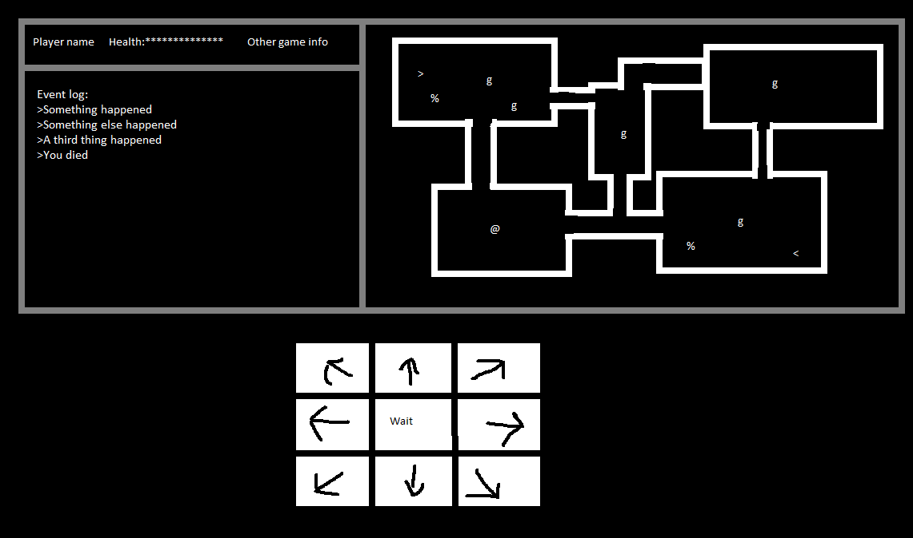

# Underworld Adventure
## Elevator pitch
Simple roguelike fantasy dungeon crawl - explore ancient ruins, fight monsters, win treasure. The game takes place on a grid, using either ASCII characters or tiles to display the contents of each cell. The action is turn based - the game only advances when the player does something. Players will use the keyboard or click buttons below the game to play.

## Implementation
### Tech used:
- HTML + CSS + Javascript
- Monospaced font for ASCII art
- free sprites for graphics
- Smarter people have already developed algorithms for generating maps, checking line of sight, and pathfinding.

### Basic design:
I'll use HTML and CSS to lay out the grid and UI, and use JS to change the contents. The script will be divided between the game logic controller and a rendering function. If I reach the stretch goal, I'll add a level generator.

## Wireframe

## MVP Goals
1. Draw the level in ASCII.
2. Draw player character and enemies.
3. Player will use numpad or click buttons to move and attack.
4. Enemies will move and attack.
5. The UI will display current health and event messages.
6. Stairs down will load next level. Reaching the end of the last level wins the game.

## Stretch Goals
- player line of sight
- draw tiles and sprites
- generate new levels each new game
- items and equipment
- Look mode
- smarter/more enemies
- scrolls?
- sound + music
- simple animations
- mouse interaction with playing field
- responsive design

## Potential Roadblocks
- If I can't figure out handling input and drawing game state to the screen, none of this works.
- I don't know enough about computer science and Javascript to know if the code I write will have reasonable performance. I could accidentally write algorithms so slow as to be unplayable.
